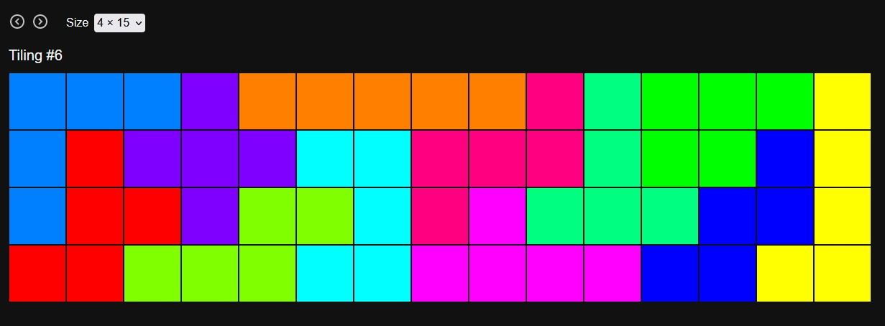

# Exact cover problem and pentomino tilings

The [pentomino](https://en.wikipedia.org/wiki/Pentomino) tilings of a rectangle, where every one of the 12 pentominoes appears exactly one, can be interpreted as an [exact cover problem](https://en.wikipedia.org/wiki/Exact_cover) and hence enumerated with [Knuth's algorithm](https://en.wikipedia.org/wiki/Knuth%27s_Algorithm_X). This repository contains

-   a Python implementation of this algorithm (see `/scripts`, the results are written to `/public/data`)
-   a visualization of these made with Svelte, which is deployed at https://pentomino-tilings.netlify.app

The exact cover algorithm in `exactcover.py` may not be optimized, but the code is incredibly short because we use Python sets (not incidence matrices) and generators - we don't need the usual "select and deselect" step.

